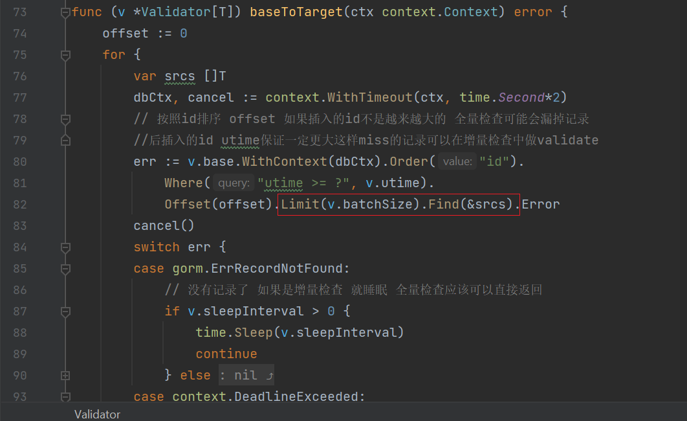

作业：实现了批量校验baseToTarget 

不停机数据迁移方案 

step1: 业务读写源表。目标表初始化
step2: 业务写源表和目标表，以源表为准，修复数据以源表为准
step3: 业务写源表和目标表，读目标表，以目标表为准
step4: 业务读写目标表

执行全量校验与修复，双写阶段维持增量校验。

通过建DoubleWritePool实现ConnPool ConnPoolBeginner接口 建DoubleWriteTx实现ConnPool和Tx接口 
来实现数据库双写 通过pattern: SrcOnly SrcFirst DstOnly DstFirst来控制双写 

Scheduler提供 http访问路由 进行四阶段SrcOnly SrcFirst DstOnly DstFirst 以及全量校验增量校验 

全量校验增量校验的取消根据 取消ctx ctx.Err退出循环 

每一次新的校验开始前需要取消旧的校验 

全量校验和增量校验在双写以源表为准的时候 和双写以目标表为准 是两个validator 

