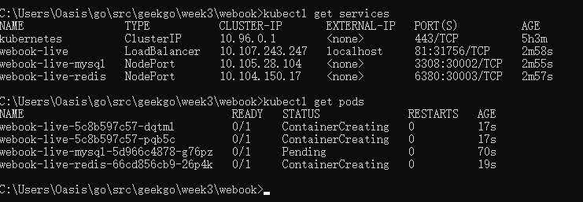

1. 切换到项目目录 
   2. 生成linux平台可执行的webook可执行文件 
   在git bash下运行 
   export GOOS=linux 
   export GOARCH=arm64 
   go build -o webook . 
3. 运行docker命令 打包成一个镜像 
   docker build -t oasis/webook:v0.0.1 
4. 修改配置文件 
5. k8s部署 
   kubectl apply -f k8s-webook-service.yaml 
   kubectl apply -f k8s-redis-service.yaml 
   kubectl apply -f k8s-mysql-service.yaml
   kubectl apply -f k8s-mysql-deployment.yaml 
   kubectl apply -f k8s-redis-deployment.yaml 
   kubectl apply -f k8s-webook-deployment.yaml 

 

