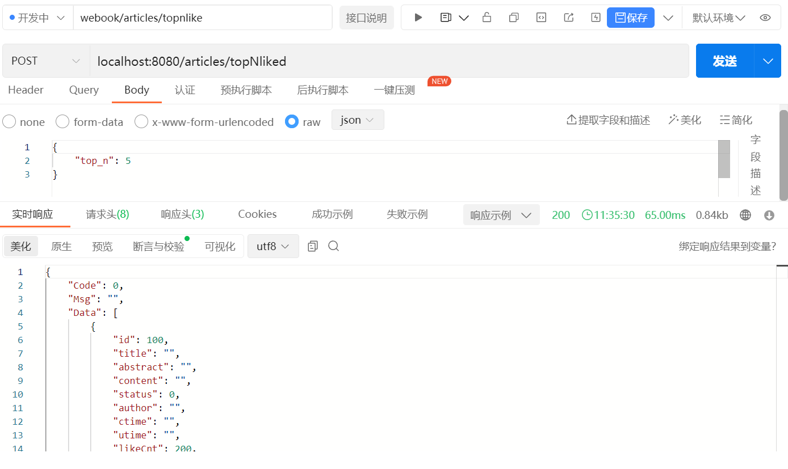

1. http请求入口 localhost:8080/articles/topNliked 
2. 保存每篇文章like_cnt计数，使用了redis sorted set数据结构, 为了防止数据量过大性能问题，分成了10个batch, 对bizId对10取模，得到该bizId应该被保存到的sorted set里。 
3. 获取topn时，会从每一个sorted set里取出topn, 合并结果排序，返回最终的topn 

