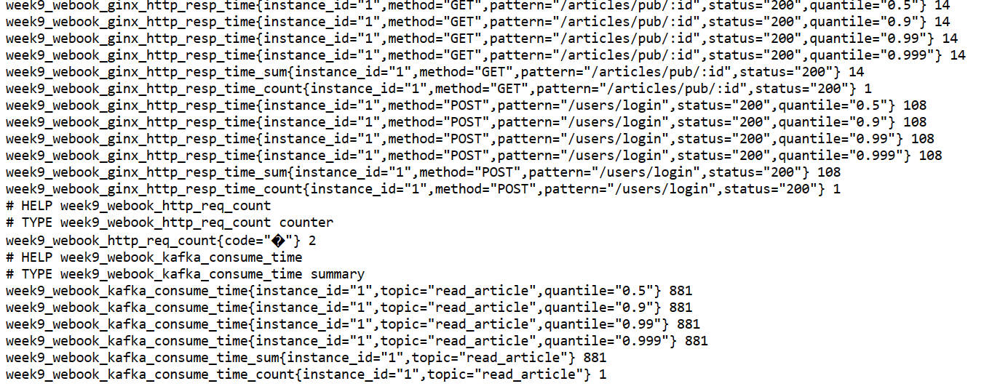

/pkgs/saramax/metrics/consumer_handler.go 提供了新的加入prometheus的ConsumeClaim方法 

kafka CounterVec分topic统计消费错误次数
kafka SummaryVec分topic统计消费时间

消费时间超过平时99线报警 
错误次数累计到阈值报警

prometheus 

webook project目录结构 
- webook
  - internal 
    - domain 
    - repository 
      - dao 
      - cache
    - service 
    - web 
  - ioc 
  - script
    - mysql 
  main.go 
  wire.go 
  